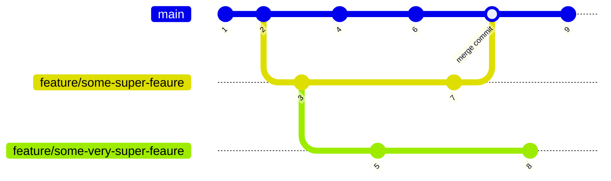

## Exercise 1: Branches

> ***If you prefer do the excercse in Visual Studio Code***

For this exercise you need only the local repository

Usefull commands:
-  `git checkout` will make you switch from one branch to another.
- `git branch` will show all the local branches in your repo.
- `git branch <branch_name>` will create a new branch with name _branch_name_ but from the current and will stay in the current branch.
- `git checkout -b <branch_name>` will create a new branch from the current one and switch to it.

## Setup:

1. Create new `exercise-1` working directory
2. In the working directory initialize a local `excercise-1` git repository
3. Run the following commands:
    - `echo "dummy" > dummy.txt`
    - `git add dummy.txt`
    - `git commit -m "dummy commit"`
    - `git checkout -b my-first-branch`
    - `git checkout main`

## Task:

1.  Use `git branch` to see the two branches that are relevant for this exercise
2. What branch are you on?
3. Use `git branch mybranch` to create a new branch called _mybranch_
4. Use `git branch` again to see the new branch created.
5. Use `git checkout mybranch` to switch to your new branch.
6. How does the output from `git status` change when you switch between the _main_ and the new branch that you have created?
7. How does the workspace change when you change between the two branches?
8. Make sure you are on your _mybranch_ branch before you continue.
9. Create a file called `file1.txt` with your name.
10. `Add` the file and `commit` with this change.
11. Use `git log --oneline --graph` to see your branch pointing to the new commit.
12. Switch back to the branch called _main_.
13. Use `git log --oneline --graph` and notice how the commit you made on the _mybranch_ branch is missing on the _main_ branch.
14. Make a new file called `file2.txt` and commit that file.
15. Use `git log --oneline --graph --all` to see your branch pointing to the new commit, and that the two branches now have different commits on them.
16. Switch to your branch _mybranch_.
17. What happened to your working directory? Can you see your `file2.txt`?
18. Use `git diff mybranch main` to see the difference between the two branches.
