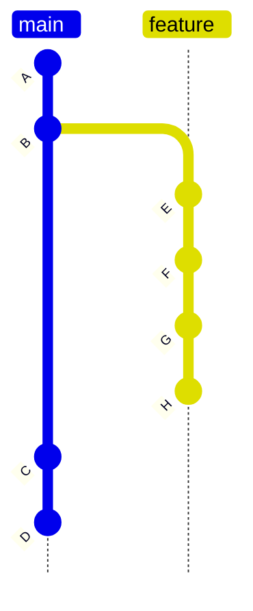
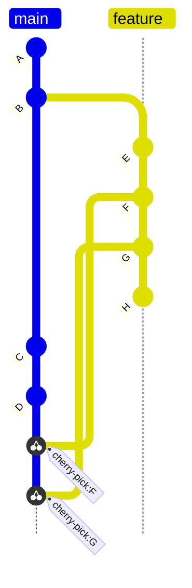

## Exercise 5: Cherry picking

> ***If you prefer do the excercse in Visual Studio Code***

For this exercise you need only the local repository

## Setup:

1. Create new `exercise-5` working directory
2. In the working directory initialize a local `excercise-5` git repository

## Task:

1.  Using git commands create the following git history

2. The _feature_ branch and the _main_ branch have progressed with different commits. Using the `cherry-pick`  command add commits F and G and onto the _main_ branch, so that Git history looks like this:

